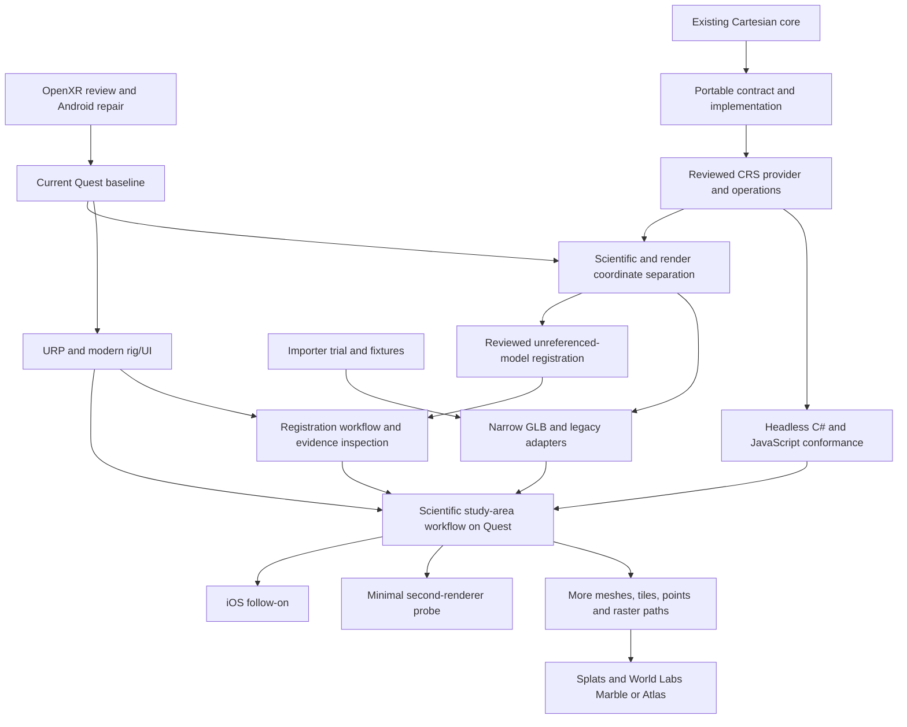

# GeoXplorer implementation and Beads execution plan

**Framework direction updated 2026-09-07.** Keep the completed first Cartesian
contract/core. The next milestones establish portable scientific meaning,
qualified CRS operations, coordinate separation, registration and evidence,
then additional adapters. Quest/OpenXR baseline remains the first runtime
integration priority. No hardware pass is established.

**Review phase complete; mechanical execution resumed.** Read the
[review decisions and next mechanical queue](review-decisions-2026-09-07.md).
Portable schema, declared registration/evidence and interaction reviews are closed.
OpenXR/importer/provider engineering choices are recorded; importer/provider
empirical qualification remains open. Future estimation/uncertainty methods are
gated by `geox-k1v.8.4`.

Read the [architecture review](framework-direction-review-2026-09-07.md),
[architecture](open-3d-plan.md), and [UI principles](ui-design-principles.md).

**Current desktop tranche, 2026-09-12.** The earlier hardware-first handoff
understated the independent domain work still reachable. Child beads `.1.6.1`
and `.8.2.1` now isolate provider-free C#/JavaScript conformance and declared
affine registration commands. They depend on the completed schema and
registration reviews; their parents retain the geodetic/runtime dependencies.
Importer child `.2.1.3` strengthens policy, test identity and Android trial
evidence. See [the desktop checkpoint](no-headset-checkpoint-2026-09-12.md).

The next runtime session still needs hardware: follow
[quest-session-next.md](quest-session-next.md) for the GeoXplorer baseline
(`geox-3kj`), offline PROJ probe (`.7.1`) and importer (`.2.1`). `.7.2` stays
behind PROJ device disposition; `.7.3` coordinate integration and `.8.3`
registration UI retain their existing prerequisites. Quest budgets remain open.
The Sept 11 importer APK remains historical evidence; use the later verified
artifact named in the desktop checkpoint for the revised harness.

Earlier 2026-09-09 receipts remain valid: OpenXR/Android
[verified APK](android-build-checkpoint-2026-09-07.md),
[portable scene](portable-scene-checkpoint-2026-09-08.md),
and [PROJ qualification](proj-qualification-2026-09-09.md).

The independent importer `.2.1` dependency review is complete: continue its
isolated glTFast 6.20.0 trial with Unity's built-in Collections 6.4.0. See the
[review disposition and ordered next steps](gltf-importer-trial.md). Official
fixture validation and all eleven local transport/fixture tests pass. The
corrected Unity Edit Mode test now passes all eleven importer cases, including
specific rejection diagnostics and cancellation requested before work. A further
bounded tranche closes child beads `.2.1.1` (authored geometry/material fidelity)
and `.2.1.2` (checkpoint cancellation, tracked resource cleanup and retry): all
four Unity tests pass. See the [tranche evidence](contracts/gltf-importer-tranche-2026-09-09.json).
The parent stays in progress for Android/IL2CPP, shader and Quest qualification;
Player lifetime, native-job interruption and broader workload coverage remain
unverified. Production adapter dependencies are unchanged.

## Outcome and scope

Modernize GeoXplorer as a geospatial/scientific spatial framework for XR, with
easy opening of scientific datasets and a quiet spatial interface on Quest. Preserve scientific scene/layer state for Earth,
Moon, Mars and local frames. Keep URP, MRTK3/XRI, networking, voice, anchors,
passthrough and retained bundle support. Remove mandatory Azure hosting and
Unity preprocessing for ordinary model inputs. iOS follows the core Quest
experience.

GitHub remains the public scope and acceptance record. Beads supplies local
implementation detail, ownership boundaries and dependencies. The existing
`.beads/` database remains git-excluded; this Markdown document is the durable
repository-facing execution map. Its issue and dependency tables are a dated
snapshot: use the current Beads state before claiming work.

## Published scope

The approved packet updated #1, #6, #39, #15, #150, #16, #17, #23, #26, #27 and
#32. Existing content and issue metadata were preserved, with only #1's title
changed. No issues were closed. All posted bodies were read back and checked.

| GitHub | Beads rollup | Purpose |
|---|---|---|
| [#1](https://github.com/fossettlab/xr-geoxplorer/issues/1) | `geox-k1v` | Full modernization and open scientific scenes. |
| [#171](https://github.com/fossettlab/xr-geoxplorer/issues/171) | `geox-k1v.1` | Scientific scene, layers, and legacy representation adapter. |
| [#172](https://github.com/fossettlab/xr-geoxplorer/issues/172) | `geox-k1v.2` | Runtime GLB and easy Quest opening. |
| [#173](https://github.com/fossettlab/xr-geoxplorer/issues/173) | `geox-k1v.3` | Registered tabletop scene, broader inputs, scientific tools. |

The subsequently supplied UI prompt is captured in `ui-design-principles.md`
and local Beads acceptance criteria. It was not included in the earlier approved
GitHub publication. UI tasks now require direct manipulation, contextual
controls, progressive disclosure, inspectable scientific information, and
tabletop/immersive continuity.

The framework revision is now published: [#174](https://github.com/fossettlab/xr-geoxplorer/issues/174)
maps to `geox-k1v.7` (CRS/coordinate boundary), and
[#175](https://github.com/fossettlab/xr-geoxplorer/issues/175) to `geox-k1v.8`
(registration/evidence). Nine related issue bodies were updated; see the
[publication record](framework-github-update-2026-09-07.md).

## Start with independent work

These can proceed concurrently in separate ownership lanes. Concurrency is
limited by available contributors and environments, not by a requirement to
launch every task at once.

| Lane | Initial work | Boundary |
|---|---|---|
| Scientific domain | Reviewed `.1.4` leads to `.1.5`; provider qualification `.7.1` can run alongside. | Existing first-increment contract/core stay closed; new work stays separate from live scene wiring. |
| Importer trial | `geox-k1v.2.1`: glTFast 6.20.0 first; UnityGLTF only on a concrete requirement failure. | Isolated project/check-out; record findings before adopting packages. |
| Input fixtures | `geox-k1v.2.2`: reproducible models and request/resource policy. | Source/license/hash inventory and adverse fixtures; no cloud uploads. |
| Spatial UI design | `geox-k1v.2.3` review is closed; the interaction contract feeds existing UI implementation tasks. | Device typography/ergonomics remain unvalidated; no shared rig/prefab changes during preparation. |
| Network preparation | `geox-k1v.4`: trial harness and service prerequisites. | Isolated setup; production Photon changes wait for the trial decision. |
| Existing-code audit | `geox-1mn` / #28: preliminary inspection completed. | Final audit follows #17/#23; see the recorded residual lifecycle work. |
| Quest baseline | `geox-3kj` / #10, followed by `geox-fzr` / #11. | One identified integration build and available headset. |

Without a connected Quest, the contract, fixture, design and trial preparation
still move forward. Portable domain work follows its review with headless and Editor tests.
Hardware-labelled tasks may have useful desk preparation; their device
acceptance remains open until it is actually exercised.

## Integration order



1. **Repair and record the current baseline.** `geox-k1v.6` reviews the supported
   OpenXR fix; `.5` applies coherent Android input/activity repair; `geox-3kj`
   records the current identified Quest build and device behavior. Performance
   and URP retain their existing order. No package upgrade is authorized merely
   by this architecture update.
2. **Solidify portable meaning.** `.1.4` reviews the schema/migration; `.1.5`
   separates the scientific document from view/session/runtime state and adds
   minimal evidence records. `.7.1` reviews CRS provider and operation policy,
   then `.7.2` implements the supported subset. `.1.6` establishes headless
   C#/JavaScript conformance alongside `.7.3` coordinate integration. Both are
   required for the scientific Quest acceptance milestone; JavaScript work
   does not block the initial Unity coordinate integration.
3. **Prove it with one input and explicit registration.** Importer trials stay
   independent. GLB `.2.4` and legacy `.1.3` consume the new boundary, without
   waiting for every registration tool. `.8.1` reviews registration/evidence
   methods; `.8.2` implements explicit solutions and `.8.3` connects the
   user-facing preview/apply/cancel/undo flow and contextual inspection to the
   modern interaction layer. `.3.6` accepts the scientific workflow on Quest.
4. **Expand from the validated workflow.** Multi-file glTF, OBJ, tiled/point/raster
   paths and later splats follow `.3.6`. `.3.10` qualifies splats and World Labs
   Marble/Atlas outputs. `.3.11` is a minimal second-renderer probe, not a parallel
   WebXR application. iOS follows the scientific Quest milestone.
5. **Keep modernization moving.** URP, rig/UI, networking/voice, anchors,
   passthrough and backend validation remain. Share canonical scientific state
   separately from personal views/room anchors. Combined #32/#33 release gates
   retain their hardware/security evidence; no single prototype closes them.

**Can overlap:** portable-schema review, importer/fixture work, UI planning,
network preparation and the current baseline investigation. After `.1.4`, the
portable implementation, CRS review and registration-method review can proceed
in separate ownership lanes. Domain work does not require a connected Quest;
production Unity integration does retain its baseline gate. Adapter breadth
has deliberately moved behind the scientific demonstration.

**Consequential reviews:** the current engineering packets are complete; see the
review decisions linked above. Return with new package/provider trial findings
that violate their acceptance conditions. Future estimation/uncertainty,
networking and scientific-tool decisions retain their separate review gates.
Do not substitute a software pass for scientific-method disposition. Keep
package/scene changes serialized through one integration owner.

## Shared files and ownership

Assign one integration owner for `Packages/manifest.json`,
`Packages/packages-lock.json`, `ProjectSettings/`, XR settings, shared platform
prefabs and the active Unity scene. URP, importer, XR, networking and UI owners
propose changes to that owner; they do not independently overwrite serialized
state in the same checkout. Keep one Editor/build/test sequence for each
integration checkpoint.

The content adapter owns a narrow `FetchAssetBundle.cs` seam. XR interaction
owns `AssetBundleInteraction.cs` changes, coordinated with content and networking.
Networking owns `LobbyManager.cs` and the shared payload contract. Changes that
cross these seams need an agreed interface and serialized integration. Proposed
new domain/loading/test directories are ownership boundaries, not a mandate
for a large framework.

Use isolated checkouts/worktrees for independent implementation and explicit
file ownership. Preserve the existing dirty Android/OpenXR/player settings and
backup files; record whether a tested APK includes them. Read current source
and completed PRs before implementing an old issue. Do not recreate the landed
bundle pipeline, backend functions, RemoteConfig or async work.

At kickoff, create a `codex/` implementation branch without discarding current
changes. The planning documents are currently uncommitted: a fresh worktree will
not automatically contain them. Copy the current planning documents into each
execution checkout, or use their committed versions once a commit is approved.
Keep Beads updates in this original workspace, using `bd -C` with its absolute
path when working elsewhere; do not initialize competing task databases in
worktrees. The integration owner coordinates task claims and shared-file changes.

## Delete and simplify during implementation

- Remove mandatory catalog registration, Azure hosting, room creation and
  bundle baking from ordinary model opening.
- Remove redundant permanent panels, toolbars, dense inspectors and duplicate
  buttons from the UI plan. Reveal useful controls in context and preserve
  access to scientific detail.
- Remove duplicated pose/reset/bounds work once callers share tested scene
  operations. Preserve special legacy DEM behavior until it has a replacement.
- Keep a small scene/layer/representation boundary. Add provider frameworks,
  caches, generic registries or pairing services only when a demonstrated need
  survives the simpler approach.
- Reassess Addressables (#27) after release for a specific retained-content
  benefit. Investigate SpaceWarp (#34) only if measured native performance
  warrants it. Both remain conditional, outside the ordinary ready queue.

## Working the queue and recording completion

```bash
bd --sandbox ready --exclude-type epic --exclude-label conditional
bd --sandbox ready --label no-device --exclude-type epic
bd --sandbox graph --all --open
bd --sandbox show geox-k1v.1.1
```

The first query lists claimable ordinary work; the second selects work that
does not require a Quest. Labels identify lanes and evidence needs, not proof
that every preparatory action is blocked. `draft-plan` identifies newly drafted
work; it does not mean implementation is running. Claim a task only when its
owner and file boundary are clear. Beads `--sandbox` prevents automatic Dolt
pushes; it still persists the local task database.

Close each implementation task with the relevant changed files, known-answer
or regression checks, build identity and device evidence. Follow the existing
Unity CLI/MCP workflow: compilation and Console checks after C# edits, relevant
EditMode/PlayMode tests and Android build, followed by the required Quest checks.
Keep importer support claims specific to the fixtures and build tested.

A spike may close with a documented no-go if it answers the question; create
or revise the dependent implementation task for the viable path. A prototype,
configured credential, or local test is not a deployed/backend/hardware result.
The scientific-method decision task needs explicit investigator disposition.
Git commits, production publishing and release follow their existing approval
boundaries; drafting Beads does not perform those actions.

## Task and dependency snapshot — 2026-09-07

Generated from the current local Beads graph after the framework revision.
Parent membership organizes work and is not a blocking edge. The table lists
blocking prerequisites still open; read the current bead before claiming it.
Completed first-increment tasks remain closed. Older receipts below are history.

| Bead | Task | Status | Open prerequisites |
|---|---|---|---|
| `geox-1mn` | (25) Async hygiene: fix async void Start, unbounded polling, HttpClient lifecycle + concurrency model decision | open | `geox-fmg`, `geox-lqh` |
| `geox-3kj` | (11) Add Meta Quest 3 build target, deploy + launch on hardware | in_progress | `geox-k1v.5` |
| `geox-5n8` | (23) Mobile companion: AR Foundation 3.1.3 → 5.x (does not touch headset path) | open | `geox-k1v.2.5`, `geox-k1v.3.6` |
| `geox-5xg` | (29b) Meta Quest store submission readiness (App Lab default) | open | `geox-71w`, `geox-p6p` |
| `geox-7w4` | (2) Built-in RP → URP migration with shader rewrites + perf regression gate | open | `geox-fzr` |
| `geox-8jf` | (12) MRTK 2.4.0 → MRTK3 runtime on OpenXR (input + interaction layer) | open | `geox-7w4` |
| `geox-8x0` | (17b) Meta XR Audio spatializer integration | open | `geox-jby` |
| `geox-71w` | (21b) Anchor persistence audit + Firebase REST replacement | open | `geox-309`, `geox-fmg`, `geox-lqh` |
| `geox-78q` | (19) Networking spike: validate NGO + Relay + Vivox on Quest 3 (3-5 day box) | open | `geox-fzr`, `geox-k1v.4` |
| `geox-309` | (21a) Azure Function auth backend shell + SAS issuance endpoint | open | `geox-3kj` |
| `geox-bau` | (13) Rebuild HandMenu, MenuManager dialogs, slates, buttons in MRTK3 | open | `geox-7w4`, `geox-8jf` |
| `geox-ctr` | (3a) AssetBundle build pipeline + initial bake against Unity 2022.3 (Built-in RP) | open | `geox-3kj` |
| `geox-fmg` | (15) Meta Spatial Anchors on Quest 3 — vertical slice (replaces ASA) | open | `geox-jby` |
| `geox-fzr` | (8) Performance baseline + per-device frame budget capture | open | `geox-3kj` |
| `geox-i1l` | (3b) Final URP-compatible AssetBundle re-bake (after URP migration lands) | open | `geox-7w4`, `geox-ctr` |
| `geox-jby` | (14) Hand tracking + XRI 3.x interactor wiring (replaces MRTK 2 interaction) | open | `geox-8jf`, `geox-bau`, `geox-k1v.1.3` |
| `geox-k1v` | Modernize GeoXplorer as a scientific spatial framework for XR | open | None |
| `geox-k1v.1` | Establish portable scientific scenes and spatial layers | open | None |
| `geox-k1v.1.1` | Define scientific scene frames and registration invariants | closed | None |
| `geox-k1v.1.2` | Implement scientific scene and layer state with invariant tests | closed | None |
| `geox-k1v.1.3` | Adapt legacy bundles to owned spatial layer representations | open | `geox-3kj`, `geox-k1v.7.3` |
| `geox-k1v.1.4` | Review the portable scientific scene schema and migration | closed | None |
| `geox-k1v.1.5` | Implement portable scene documents and minimal evidence records | closed | None |
| `geox-k1v.1.6` | Prove scene meaning with headless C# and JavaScript readers | open | `geox-k1v.7.2` |
| `geox-k1v.2` | Open HTTPS GLB as a spatial layer on Quest | open | None |
| `geox-k1v.2.1` | Trial runtime glTF loading on Unity 6 and Android | open | None |
| `geox-k1v.2.2` | Prepare model fixtures and bounded URL-loading policy | in_progress | None |
| `geox-k1v.2.3` | Specify easy Quest opening, layers, and shared-session flows | closed | None |
| `geox-k1v.2.4` | Implement bounded GLB loading as a layer representation | open | `geox-3kj`, `geox-k1v.2.1`, `geox-k1v.2.2`, `geox-k1v.7.3` |
| `geox-k1v.2.5` | Validate the modernized GLB scene workflow on Quest | open | `geox-7w4`, `geox-bau`, `geox-jby`, `geox-k1v.1.3`, `geox-k1v.2.4`, `geox-n3b` |
| `geox-k1v.2.6` | Implement validated link handoff and local file opening | open | `geox-k1v.2.5` |
| `geox-k1v.2.7` | Open multi-file glTF with consistent companion resource handling | open | `geox-k1v.2.2`, `geox-k1v.2.4`, `geox-k1v.2.5`, `geox-k1v.3.6` |
| `geox-k1v.3` | Validate scientific scene continuity and expand adapters | open | None |
| `geox-k1v.3.1` | Build a reproducible registered tabletop scene fixture | open | `geox-jby`, `geox-k1v.2.2`, `geox-k1v.2.4`, `geox-k1v.7.3` |
| `geox-k1v.3.2` | Evaluate tiled layers against the qualified spatial framework | open | `geox-k1v.3.6`, `geox-k1v.7.2` |
| `geox-k1v.3.3` | Add OBJ with material and texture companion loading | open | `geox-k1v.2.2`, `geox-k1v.2.4`, `geox-k1v.2.5`, `geox-k1v.2.7`, `geox-k1v.3.6` |
| `geox-k1v.3.4` | Evaluate point-cloud and raster/vector layer input paths | open | `geox-k1v.3.2` |
| `geox-k1v.3.5` | Extend mesh inputs to STL, mesh PLY, and FBX | open | `geox-k1v.2.5`, `geox-k1v.3.3` |
| `geox-k1v.3.6` | Validate registered tabletop scenes and anchors on Quest | open | `geox-fmg`, `geox-k1v.1.6`, `geox-k1v.2.5`, `geox-k1v.3.1`, `geox-k1v.8.3` |
| `geox-k1v.3.7` | Specify scientific measurement and display-tool semantics | open | `geox-k1v.3.1` |
| `geox-k1v.3.8` | Transition between tabletop and immersive scene viewing | open | `geox-k1v.3.6` |
| `geox-k1v.3.9` | Implement reviewed scientific measurement and display tools | open | `geox-k1v.3.6`, `geox-k1v.3.7` |
| `geox-k1v.3.10` | Qualify splats and World Labs Marble or Atlas outputs as layers | open | `geox-k1v.3.4`, `geox-k1v.3.6` |
| `geox-k1v.3.11` | Validate one scientific scene in a minimal second renderer | open | `geox-k1v.1.6`, `geox-k1v.3.6` |
| `geox-k1v.4` | Prepare modern networking trial and service prerequisites | in_progress | None |
| `geox-k1v.5` | Repair Unity 6 Android input and activity compatibility | closed | `geox-k1v.6` |
| `geox-k1v.6` | Qualify OpenXR 1.17.0 for the input layout collision | closed | None |
| `geox-k1v.7` | Add qualified geodetic operations and coordinate isolation | open | None |
| `geox-k1v.7.1` | Qualify CRS provider, operation policy and planetary scope | open | None |
| `geox-k1v.7.2` | Implement the reviewed geodetic operation subset | open | `geox-k1v.7.1` |
| `geox-k1v.7.3` | Isolate scientific world, scene, render and XR coordinates | open | `geox-3kj`, `geox-k1v.7.2` |
| `geox-k1v.8` | Register unreferenced models with inspectable scientific evidence | open | None |
| `geox-k1v.8.1` | Review registration methods and uncertainty semantics | closed | None |
| `geox-k1v.8.2` | Implement explicit registration of unreferenced layers | open | `geox-k1v.7.3` |
| `geox-k1v.8.3` | Implement contextual registration and scientific inspection | open | `geox-bau`, `geox-jby`, `geox-k1v.8.2` |
| `geox-k1v.8.4` | Review estimated registration and uncertainty methods when needed | open | `geox-k1v.3.6` |
| `geox-k1v.9` | Complete the review phase and pause before implementation | closed | None |
| `geox-lqh` | (20) Networking rewrite: migrate off Photon PUN 2 to chosen stack | open | `geox-78q`, `geox-jby`, `geox-k1v.2.4` |
| `geox-n3b` | Quest UI/keyboard rig + scene rebuild (deferred from #143) | open | `geox-bau`, `geox-jby`, `geox-k1v.2.4` |
| `geox-ntx` | (29c) Conditional: Application SpaceWarp spike (only if perf budget missed) | open | `geox-k1v.2.5` |
| `geox-o5k` | (24) AssetBundles → Addressables (post-v1, do not start before Quest 3 ships) | open | `geox-5xg` |
| `geox-p6p` | (29) Hardware-in-the-loop smoke test suite (Quest 3) | open | `geox-8x0`, `geox-309`, `geox-fmg`, `geox-i1l`, `geox-k1v.2.5`, `geox-k1v.3.6`, `geox-lqh`, `geox-vuc` |
| `geox-vuc` | (17) Quest 3 passthrough + scene understanding + depth occlusion | open | `geox-7w4`, `geox-jby` |

### Creation and verification record

Created 23 local Beads records: 3 GitHub-linked epics and 20 implementation,
spike or decision tasks. Enriched the 23 existing open records and retained all
5 closed records, prior blocking edges, priorities, ownership and external
references. The existing modernization rollup is now an epic.

The planned dependencies match the stored graph. The initial ordinary ready
queue has 7 tasks, listed above. No task was assigned or started by this pass.
Beads graph integrity and cycle checks pass; lint reports no template warnings
across the 46 open records. Planning-document links and whitespace were checked,
and the pre-existing settings/backup file hashes remain unchanged.
The local export is `.beads/open-3d-issues-20260904.jsonl`; the key-to-ID mapping
is `.beads/open-3d-plan-ids-20260904.json`. These remain git-excluded.

### Execution checkpoint: coordinate-contract review

Execution has begun on `codex/scientific-scene-foundation`. Bead
`geox-k1v.1.1` is in progress, with the
[scientific scene contract](scientific-scene-contract.md) ready for consequential
review. Its synthetic fixture script passes its arithmetic checks and Ruff.
These checks validate authored examples, not a Unity implementation.

The user requested notification at consequential review points so they can
switch to higher effort. Review the proposed Cartesian registration scope,
unknown-input handling, scientific/display coordinate boundary and persistence
contract before closing this bead or starting dependent domain code. Record the
disposition in Beads and the contract. The broader execution goal remains active;
no runtime, package, scene or prefab change was made at this checkpoint.

### Independent preliminary async audit

The [source audit](async-hygiene-audit.md) confirmed landed async fixes and
identified residual anchor lifecycle work. The live #28 explicitly requires
final auditing after #17/#23; those missing local blocking edges are now
restored. Its preliminary inspection is complete, but the bead remains open
for the final audit. The initial ready-queue count above is a historical
creation snapshot. The attempted C# lint command could not run because
`dotnet` was not available on PATH. No runtime files were changed.

### Independent interaction draft

The [Quest opening flow](quest-open-flow.md) records current #15/#150 and prefab
wiring, contextual-state wireframes, recovery behavior, proposed loader messages,
handoff/file constraints and design-test disposition. `geox-k1v.2.3` remains in
progress and is labelled ready for review. Its wireframes are not rendered
visuals or evidence of headset usability; typography, actual input bindings and
spatial placement require implementation/device review. Document checks and
Beads lint pass. No runtime or serialized Unity assets were changed.

### Initial model-input fixture preparation

The [fixture generator](../scripts/generate_model_input_fixtures.py) writes a
small authored correctness/adverse set outside Unity with hashes and expected
behavior. Five offline integrity/reproducibility tests and Ruff pass. See the
[policy and remaining work](model-input-policy.md). `geox-k1v.2.2` remains in
progress: official format validation, transport cases, pressure workloads and
device-derived resource budgets are not complete. The validator package query
failed and automatic approval review rejected network escalation; no official
validator result is claimed. No importer or runtime policy was installed.

The local HTTP fault harness and response tests are now written. Ruff passes;
the combined run passed five offline tests and skipped six socket tests because
the sandbox prohibits loopback listeners. Transport behavior therefore remains
unverified. See `docs/model-input-policy.md` before running or interpreting the
harness. The fixture bead remains in progress.

### Connected Editor baseline and networking preparation

Unity 6000.4.4f1 opened in automated mode. All 18 discovered Edit Mode tests
passed, with no skipped or failed tests, including both existing PUN wire
contract tests. Android build support is installed. This is Editor evidence,
not an APK or Quest performance result. The Console reports an authentication
failure for online package search; candidate package qualification remains open.

The existing networking setup documents were retained and clarified so the
historical Unity 2022.3 pins cannot be mistaken for qualified Unity 6 pins.
`geox-k1v.4` remains in progress; see the checkpoint in
[networking-spike.md](networking-spike.md). The coordinate contract still awaits
consequential review before dependent implementation starts.

### Android baseline attempt: input integration review required

The existing Android configuration passed Pipeline build dry-run validation,
then build `build_1f5bf6db8a7f` failed before producing an APK. Unity rejected
Active Input Handling set to **Both** on Android. The serialized value is
`activeInputHandler: 2`. The build also warned that Unity 6 requires Game
Activity. No settings were changed to suppress these findings.

`GeoXInput.cs` already uses the new Input System. A source search found legacy
input calls in bundled MRTK input simulation and Photon demos; this does not
prove those paths are active in the build scene. The recommended review path
is to qualify new-Input-System-only operation and Game Activity against the
active rig/UI dependencies, then rebuild and validate on Quest. Do not choose
legacy-only merely to obtain an APK or delete vendor code based on this search.
This is the requested consequential Unity/XR integration review boundary.

The bundled SDK's `adb devices -l` returned an empty device list. #10 remains
incomplete: no APK identity, boot, stereo, tracking or performance pass is
claimed. The existing Editor tests remain separate evidence.

Post-build integrity checking found that `ProjectSettings.asset` no longer
matches its pre-execution hash. Its current Git diff contains two preloaded
asset references; the other five protected settings/backup hashes still match.
The original file was already dirty and only its hash was retained, so the
exact additional serialization change cannot yet be attributed. Preserve it
for review rather than reverting the user's existing settings. No explicit
input or entry-point setting edit was made by the agent.

### Consequential review completed, 2026-09-06

The user requested the review. The
[review disposition](implementation-review-2026-09-06.md) accepts the corrected
[coordinate contract](scientific-scene-contract.md) for domain implementation.
It makes common-unit conversion, representation-to-source mapping, affine
fidelity and precision ownership explicit, and removes independent calibration
as a prerequisite for source-based display scale. The expanded authored
fixtures and Ruff pass; actual domain tests are the next implementation step.
`geox-k1v.1.1` can close and `geox-k1v.1.2` can proceed.

Android integration will use the new Input System and GameActivity. The review
traced an enabled legacy MRTK input module in the Quest and mobile prefabs and
found that the configurator restores Both and the old activity. Implement a
coherent UI input/configurator/manifest correction before rebuilding, rather
than only flipping Player Settings. This implementation work belongs to #10's
baseline repair and must not imply completion of #14–16 or hardware acceptance.
The two preloaded asset references resolve to XR/OpenXR settings; package build
processors offer a plausible explanation, but do not prove the exact original
dirty-state delta. Preserve and snapshot those settings before further builds.

These engineering decisions no longer need a repeat approval. Package
qualification, actual Quest results and later scientific-method decisions
retain their separate acceptance criteria. No runtime or settings edit was
made in this review.

### Implementation checkpoint, 2026-09-07

See [implementation and review packet](execution-checkpoint-2026-09-07.md).
`geox-k1v.1.2` is closed with 28 passing domain tests. Prepared Android bridge
and configurator changes belong to `geox-k1v.5`; four bridge tests pass.
The complete suite is 50/51, with the remaining failure exposing an installed
OpenXR device-layout conflict. New review bead `geox-k1v.6` qualifies the
supported OpenXR 1.17.0 fix and its changed defaults before integration.

Dependency order: `geox-k1v.6` → `geox-k1v.5` → `geox-3kj` → existing
performance/URP/rig/UI sequence. The Android settings command remains unapplied.
The overall objective remains incomplete at the requested consequential review.

### Framework direction revision, 2026-09-07

The new product direction retains the implemented core and promotes portable
scientific meaning ahead of adapter breadth. Added 13 Beads records: portable
contract/implementation/conformance tasks, CRS and registration rollups with
review/implementation tasks, plus later splat and second-renderer probes.
Dependencies above reflect the stored graph. See the
[review](framework-direction-review-2026-09-07.md) and
[short pitch deck](geoxplorer-pitch-deck.md). No runtime or method change was made
by this planning pass; the preceding OpenXR failure remains unresolved.


### Readiness check, 2026-09-07

The existing Beads are sufficient to continue; no further epic or broad planning
pass is needed. The live graph is acyclic. Two corrections improve execution:
independent-reader conformance runs alongside Unity coordinate integration and
joins the scientific-scene acceptance gate, and `.8.3` now explicitly owns the
user-facing registration workflow as well as evidence inspection.

Next priority is `.6` OpenXR qualification, followed by `.5` Android repair and
`geox-3kj` current Quest baseline. `.1.4` portable-schema review can proceed
alongside this; its completion opens `.1.5`, `.7.1` and `.8.1` in separate lanes.
The existing `.2.1` importer trial and in-progress fixtures/UI/network preparation
remain available. Review decisions are real remaining work, not new permission
to rebuild the architecture. Runtime, package and scientific-method gates stay
explicit; no issue closure or hardware pass is implied by this readiness check.
