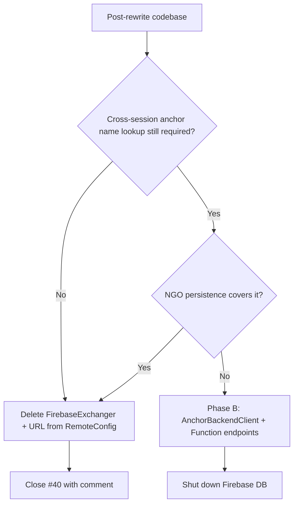

# Firebase anchor persistence — pre-audit (#40 Phase A)

**Status:** read-only audit (2026-08-02). Phase B implementation waits on #17
(Meta anchors) and #23 (networking rewrite) landing, then re-run Phase A against
the post-rewrite codebase.

## Current endpoint

All environments point at the same unauthenticated Firebase Realtime Database URL
(committed in RemoteConfig assets):

```text
https://flasasharing.firebaseio.com/anchors.json
```

Configured in:

- [`RemoteConfig.Dev.asset`](../Assets/Settings/Config/RemoteConfig.Dev.asset)
- [`RemoteConfig.Staging.asset`](../Assets/Settings/Config/RemoteConfig.Staging.asset)
- [`RemoteConfig.Prod.asset`](../Assets/Settings/Config/RemoteConfig.Prod.asset)

Field: `firebaseAnchorsUrl` on [`RemoteConfig.cs`](../Assets/Scripts/Config/RemoteConfig.cs).

**Security posture:** anyone who knows the URL can GET the full anchor list and PUT
overwrites the entire array. There is no API key. This blocks App Lab / store
readiness (#33) until replaced or deleted.

## Data model

[`FirebaseExchanger.AzureSpatialAnchorObject`](../Assets/Scripts/FirebaseExchanger.cs)
(JSON via Newtonsoft):

| Field | Type | Purpose |
|---|---|---|
| `name` | string | User-chosen room/anchor label (UI input) |
| `identifier` | string | Azure Spatial Anchor cloud ID |
| `dateCreated` | DateTime | Local timestamp on upload |
| `dateExpired` | DateTime | ASA expiration; expired rows filtered on fetch |

Storage shape: **single JSON array** at the Firebase URL. Upload uses HTTP PUT
replacing the **entire list** (read-modify-write in client).

## Call sites (4 files)

| File | Usage |
|---|---|
| [`FirebaseExchanger.cs`](../Assets/Scripts/FirebaseExchanger.cs) | Singleton; GET on Start; PUT on anchor create |
| [`CreateASA.cs`](../Assets/Scripts/CreateASA.cs) | After ASA save → `PutAnchorsAndWait`; sets UI label from `anchorName` |
| [`FindASA.cs`](../Assets/Scripts/FindASA.cs) | Refresh + `FindAnchorByName()` → ASA identifier lookup |
| [`RoomManager.cs`](../Assets/Scripts/RoomManager.cs) | Name conflict / existence checks before create or find flows |

No other scripts reference `FirebaseAnchorsUrl` directly.

## Behaviour summary

1. **Startup:** `FirebaseExchanger.Start` → `FetchCurrentAnchors` (GET entire list).
2. **Create flow:** refresh → reject duplicate name → append record → PUT full list.
3. **Find flow:** refresh → lookup name → return ASA `identifier` for watcher.
4. **Failure handling:** upload blocked if refresh fails; fetch failures leave
   `lastFetchSucceeded = false` (guards added in prior bugfix PRs).

## Overlap with networking (#23)

Anchor **ID exchange over the wire** during a live session is separate from
Firebase persistence:

- PUN RPC / buffered calls propagate `GenericNetworkManager.AzureAnchorID` to
  connected clients (see [`docs/networking-harness.md`](networking-harness.md)).
- Firebase persists the **name → cloud anchor ID** mapping across sessions so a
  later client can resolve a human-readable room name days later.

NGO `NetworkVariable` / RPC can replace the live exchange; Firebase (or its
replacement) still needed **if** cross-session name lookup remains a product
requirement.

## Phase A decision tree (run after #17 + #23)



**Pre-audit expectation:** Phase B is **likely** — room names and ASA/Meta anchor
IDs must survive app restarts until Meta anchor groups or marker-based alignment
(#17) fully replaces the workflow.

## Phase B replacement (scaffolded, not wired)

Azure Function endpoints (same app as #24 SAS):

- `GET /api/anchors` — list all records (Firebase-compatible JSON array)
- `POST /api/anchors` — store one record; returns `id`
- `GET /api/anchors/{id}` — retrieve by id (admin/debug; not used by current app)

Unity client target: [`AnchorBackendClient.cs`](../Assets/Scripts/Config/AnchorBackendClient.cs)
(replaces `FirebaseExchanger.cs` when wired). Scaffold: [`functions/anchor_persistence.py`](../functions/anchor_persistence.py).

Full wiring guide: [`docs/firebase-to-anchor-migration.md`](firebase-to-anchor-migration.md).

## Cutover checklist (Phase B)

- [ ] Deploy anchor endpoints with Table Storage backing (see [`docs/azure-function-provisioning.md`](azure-function-provisioning.md))
- [x] Implement `AnchorBackendClient` mirroring Firebase list/create shape
- [ ] Migrate call sites in post-#17 anchor code
- [ ] Smoke test on Quest: GET list, POST create, verify name lookup
- [ ] Remove `firebaseAnchorsUrl` from all RemoteConfig assets
- [ ] Make Firebase database read-only → delete after 30 days
- [ ] Grep repo: zero `firebaseio.com` references

## Related

- [#40](https://github.com/fossettlab/xr-geoxplorer/issues/40) — this ticket
- [#24](https://github.com/fossettlab/xr-geoxplorer/issues/24) — Function App shell
- [`docs/auth-backend.md`](auth-backend.md) — SAS + anchor endpoint contract
