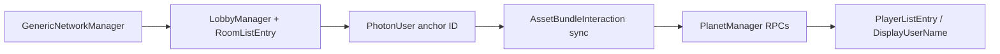

# Networking file inventory — PUN 2 surface area (#23)

**Status:** read-only audit (2026-08-02). Generated from repo grep on `main`.
Use with [`docs/networking-rewrite-plan.md`](networking-rewrite-plan.md) and
[`docs/networking-harness.md`](networking-harness.md).

## Summary

| Metric | Count |
|---|---|
| App scripts referencing Photon APIs | 15 files |
| `[PunRPC]` methods in app scripts | 11 methods (3 files) |
| `OnPhotonSerializeView` serializers | 1 (`AssetBundleInteraction`) |
| EditMode contract tests | 2 (`PunWireContractTests`) |

Vendor trees (`Assets/Photon/`, `Assets/MRTK/`) are out of scope — delete with
Phase 3 of the rewrite plan.

## `[PunRPC]` call sites (migrate first)

| File | Methods | Purpose |
|---|---|---|
| [`AssetBundleInteraction.cs`](../Assets/Scripts/AssetBundleInteraction.cs) | `CreateABTooltipAtLoc`, `OnHideTooltip`, `OnMakeFullScale`, `OnFlagCreate`, `OnReset`, `OnDelete` | Shared model interaction + tooltip sync |
| [`AssetBundleInteraction.cs`](../Assets/Scripts/AssetBundleInteraction.cs) | `OnPhotonSerializeView` | Transform sync (position/rotation/scale) |
| [`PlanetManager.cs`](../Assets/Scripts/PlanetManager.cs) | `CreateTooltipAtLoc`, `GoToTiles` | Globe tile navigation sync |
| [`PhotonUser.cs`](../Assets/Scripts/PhotonUser.cs) | `RPC_SetNickName`, `RPC_SetSharedAnchorID` | Player name + shared anchor ID propagation |

## Photon API usage by file (match count)

Sorted by total `PhotonNetwork` / `PhotonView` / `PunRPC` references:

| File | Refs | Role in rewrite |
|---|---|---|
| [`AssetBundleInteraction.cs`](../Assets/Scripts/AssetBundleInteraction.cs) | 41 | Phase 2 — transform + interaction RPCs → NGO |
| [`LobbyManager.cs`](../Assets/Scripts/LobbyManager.cs) | 30 | Phase 2 — room list → Unity Lobby |
| [`PlanetManager.cs`](../Assets/Scripts/PlanetManager.cs) | 11 | Phase 2 — globe RPCs |
| [`PlayerListEntry.cs`](../Assets/Scripts/PlayerListEntry.cs) | 6 | Phase 2 — UI player list |
| [`PhotonUser.cs`](../Assets/Scripts/PhotonUser.cs) | 5 | Phase 2 — anchor ID + nickname RPCs |
| [`RoomListEntry.cs`](../Assets/Scripts/RoomListEntry.cs) | 3 | Phase 2 — room list UI |
| [`OnClickModelInteraction.cs`](../Assets/Scripts/OnClickModelInteraction.cs) | 2 | Phase 2 — local click → RPC trigger |
| [`GenericNetSync.cs`](../Assets/Scripts/GenericNetSync.cs) | 2 | Phase 2 — generic transform sync |
| [`FetchAssetBundle.cs`](../Assets/Scripts/FetchAssetBundle.cs) | 2 | Phase 2 — networked bundle spawn |
| [`SpotInteraction.cs`](../Assets/Scripts/SpotInteraction.cs) | 1 | Phase 2 |
| [`HandMenuManager.cs`](../Assets/Scripts/HandMenuManager.cs) | 1 | Phase 2 |
| [`GenericNetworkManager.cs`](../Assets/Scripts/GenericNetworkManager.cs) | 1 | Phase 2 — **session hub** (start here) |
| [`DisplayUserName.cs`](../Assets/Scripts/DisplayUserName.cs) | 1 | Phase 2 |
| [`ConnectionStatus.cs`](../Assets/Scripts/ConnectionStatus.cs) | 1 | Phase 2 |
| [`SoundToggleManager.cs`](../Assets/Scripts/SoundToggleManager.cs) | 1 | Phase 3 — voice-adjacent |

## Recommended migration order (matches rewrite plan Phase 2)



1. **`GenericNetworkManager`** — connect/disconnect, room lifecycle
2. **`LobbyManager` / `CreateRoomManager` / `RoomListEntry`** — lobby UI
3. **`PhotonUser.RPC_SetSharedAnchorID`** — `NetworkVariable<string>` for `AzureAnchorID`
4. **`AssetBundleInteraction.OnPhotonSerializeView`** — `NetworkTransform` or custom sync
5. **Remaining PunRPCs** in `AssetBundleInteraction`, `PlanetManager`
6. **Voice** — Photon Voice → Vivox (Phase 3)

## Harness contracts to preserve

From [`PunWireContractTests.cs`](../Assets/Tests/Network/PunWireContractTests.cs):

| Test | Behaviour pinned |
|---|---|
| `SerializeView_Read_StoresReceivedPositionRotationScale` | Receive path: position → rotation → scale field order |
| `SharedAnchorIdHandler_WritesIdIntoNetworkManager` | Anchor ID string lands in `GenericNetworkManager.AzureAnchorID` |

Add parallel NGO tests **before** deleting PUN tests.

## Regenerate this inventory

```bash
rg -l 'PunRPC|PhotonNetwork|PhotonView' Assets/Scripts --glob '*.cs' | sort
rg -c 'PunRPC|PhotonNetwork|PhotonView' Assets/Scripts --glob '*.cs' | sort -t: -k2 -nr
rg -n '\[PunRPC\]' Assets/Scripts --glob '*.cs'
```

## Related tickets

- [#22](https://github.com/fossettlab/xr-geoxplorer/issues/22) — NGO spike (go/no-go)
- [#23](https://github.com/fossettlab/xr-geoxplorer/issues/23) — production rewrite
- [#21](https://github.com/fossettlab/xr-geoxplorer/issues/21) — harness (done on main)
