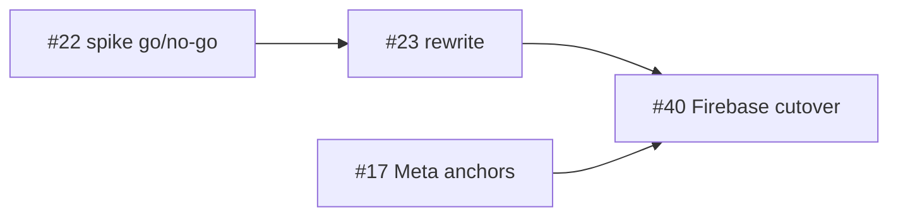

# Networking rewrite plan — PUN 2 → NGO + Relay + Vivox (#23)

**Status:** planning doc only. Do not start the production rewrite until the #22
spike scorecard recommends **go** on NGO + Relay + Vivox.

## Goal

Replace Photon PUN 2 (40+ `[PunRPC]` call sites, Photon Voice) with Unity Netcode
for GameObjects + Unity Relay + Vivox while preserving the wire contracts pinned
by the #21 characterization harness.

## Regression target (from #21)

The rewrite must preserve these observable behaviours:

| Contract | Current (PUN) | NGO equivalent |
|---|---|---|
| Transform sync payload | 3 floats/vectors in order: position, rotation, scale | `NetworkTransform` or custom `NetworkVariable`/RPC with same field order |
| Shared anchor ID | Buffered RPC → `GenericNetworkManager.AzureAnchorID` | `NetworkVariable<string>` or server-authoritative RPC with same field name semantics |
| Room join | Photon room lobby | NGO + Unity Lobby + Relay allocation |
| Voice | Photon Voice | Vivox channel tied to session id |
| Teardown | `PhotonNetwork.LeaveRoom` | NGO shutdown + Lobby leave + Vivox disconnect |

EditMode contract tests live in [`Assets/Tests/Network/PunWireContractTests.cs`](../Assets/Tests/Network/PunWireContractTests.cs). Add parallel NGO contract tests before deleting PUN tests.

## Recommended migration phases

### Phase 0 — Spike (#22, Mac + Quest)

Throwaway Unity project; fill [`docs/networking-spike.md`](networking-spike.md)
scorecard. Hard stop at 5 days.

### Phase 1 — Infrastructure (cloud + Mac)

- Unity Cloud project: Relay, Lobby, Vivox enabled
- Package add to main repo: `com.unity.netcode.gameobjects`, `com.unity.services.relay`, `com.unity.services.lobby`, Vivox
- `NetworkBootstrap` scene object: authenticate UGS, allocate Relay, start host/client
- No gameplay migration yet — empty scene with cube sync + voice

### Phase 2 — Session layer

Replace in order (each PR keeps Android build green):

1. **`GenericNetworkManager`** — connection, room create/join, disconnect
2. **`LobbyManager` / `CreateRoomManager`** — UI wired to Lobby service instead of Photon room list
3. **Transform sync** — migrate `GenericNetSync` / ownership to NGO `NetworkTransform`
4. **Anchor ID bridge** — replace PunRPC with `NetworkVariable` or ServerRpc; keep `AzureAnchorID` field name until #17 renames it

### Phase 3 — Voice + cleanup

- Remove Photon Voice; wire Vivox to session id
- Delete `Assets/Photon/` vendor tree
- Remove Photon scripting defines from Player Settings
- Update Tier 2 manual procedure in `docs/networking-harness.md` for NGO

### Phase 4 — Firebase / anchor backend

Only after Phase 2–3 stable: revisit #40 (Firebase → Function anchor store).

## Files with highest PunRPC / Photon surface area

Run before starting:

```bash
rg -l 'PunRPC|PhotonNetwork|PhotonView' Assets/Scripts --glob '*.cs'
```

Expect touch points in: `GenericNetworkManager`, `LobbyManager`, `PlanetManager`,
`MenuManager`, `RoomManager`, voice under `Assets/Photon/`.

Full file-level inventory: [`docs/networking-file-inventory.md`](networking-file-inventory.md).

## Out of scope for #23

- Normcore (dropped)
- Photon Fusion (fallback only if #22 no-go)
- Cross-platform HL2 networking (HL2 dropped)
- Changing anchor persistence shape (#40)

## CI strategy

| Tier | Gate | Tool |
|---|---|---|
| 1 | Wire contract + handler effect | EditMode tests (NGO mocks, no cloud) |
| 2 | Four live workflows | Manual Quest + Editor (see networking-harness.md) |

## Dependencies



## Docs

- Harness: [`docs/networking-harness.md`](networking-harness.md)
- Spike: [`docs/networking-spike.md`](networking-spike.md)
- NGO: https://docs-multiplayer.unity3d.com/netcode/current/about/
