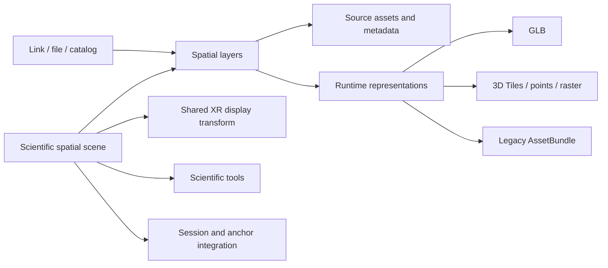

# GeoXplorer scientific spatial framework and open inputs

**Status: framework direction updated 2026-09-07.** The
[framework review](framework-direction-review-2026-09-07.md) defines the next
scientific milestones; the [execution plan](beads-execution-plan.md) carries
their dependencies. Keep the completed Cartesian core and all modernization.
Portable interchange, full geodetic operations and runtime GLB remain work to
implement. **Quest first; iOS later.**

## Product outcome

GeoXplorer is a geospatial and scientific spatial framework for XR. Combine,
inspect and share registered scientific datasets while preserving coordinates,
units, scale, provenance, and relationships. Opening a model on Quest should be
quick and easy. It should not require an Azure account, catalog registration,
or a Unity AssetBundle bake. Azure remains a supported host/catalog source;
existing bundles, shared sessions, and spatial anchoring remain supported.

The first complete new input is an HTTPS GLB. Broader mesh and geospatial input
support is part of the product, with explicit support milestones rather than
an unsupported promise that every file works. An iOS viewer follows the Quest
work; retain existing mobile code while keeping new content code portable.

The supplied **GeoXplorer Open 3D Architecture** and **Scientific spatial scene**
addendum inform this plan. Their code sketches and execution instructions are
proposals to assess, not commands to execute verbatim. A scientific scene owns
registered layers; GLB, tiles, rasters, and bundles are representations beneath
those layers. `GeoXSceneObject` is a runtime helper, not the domain model.

## What stays, what changes

| Area | Disposition |
|---|---|
| Unity 6 / OpenXR, build and sideload loop | Keep. Validate the current build on Quest. |
| URP (#13) | Keep the migration and approved starting configuration. Coordinate GLB shader validation with it. |
| MRTK3/XRI (#14–16) | Keep modernization; manipulate the scene display root while registered layers retain their relative placement. |
| Networking, voice, anchors (#17, #19, #21–23, #40) | Keep. Content-source changes do not replace these systems. |
| Passthrough and scene features (#18) | Keep, with their existing hardware validation. |
| Azure catalog, hosting, access controls (#6, #24, #39) | Keep for curated and restricted content. They become optional for opening an independently hosted model. |
| Scene/model experience (#15, #150) | Add direct opening, layer visibility, selection, and metadata. Opening a personal model creates a scene with one layer; shared sessions remain available. |
| iOS (#26) | Follow the Quest implementation and acceptance; reuse loaders and model state with mobile interaction/file entry. |
| 3D Tiles / Cesium / STAC | Evaluate for broader geospatial inputs; do not install speculative infrastructure in the GLB change. |

Do not close or reprioritize unrelated modernization issues as part of this
content change. The narrow edits in [the approved issue packet](open-3d-issue-drafts.md)
are published, including new issues [#171](https://github.com/fossettlab/xr-geoxplorer/issues/171),
[#172](https://github.com/fossettlab/xr-geoxplorer/issues/172), and
[#173](https://github.com/fossettlab/xr-geoxplorer/issues/173).

## First-principles review

**Remove the publishing prerequisite.** A model's host, file format, and
scientific meaning are independent. Azure can serve GLB, another host can serve
GLB, and trusted legacy catalogs can still serve AssetBundles. Putting a URL
override into the old bundle loader would remove only the host dependency.

**Remove unnecessary steps from opening a model.** The primary action should be
Open model. Room creation, account setup for content hosting, category selection,
and metadata entry should not be prerequisites for viewing a user's file.
This is an additional route into the modernized app, not removal of collaboration.

**Keep a small scientific framework with a portable contract.** A scene, layer,
operation record and replaceable representation preserve scientific meaning.
Separate scientific persistence from optional view/session state; validate it
with independent readers. Defer a discovery-provider framework, exhaustive content-type
enum, generic capability registry, persistent download cache, and catalog
server until a real consumer needs them. A semantic category never selects a parser.

**Remove per-layer automatic normalization from the new registered path.**
Independently centering/resizing imported layers destroys their alignment.
Fit the whole scene to the table through one display transform. Preserve the
old bundle normalization inside the legacy path until its migration is tested.

**Do not rebuild existing working infrastructure.** Retain the bundle pipeline,
metadata inventory, platform bootstrapper, RemoteConfig, and backend work.
Addressables (#27) may still serve Unity-specific content; reassess its concrete
benefit before implementing it. It cannot satisfy general runtime model import.

**Do not port every historical screen verbatim or build a general 3D editor.**
Modernize opening, layers, metadata, scientific interaction, catalogs, and
shared sessions. Model authoring, physics sandboxes, and animation editing are
outside the product. Review #150 against these flows rather than importing the
old scene/bootstrapper wholesale merely because it was already written.

**Deletion now:** replace the stale local spec's duplicated roadmap with a short
pointer to this plan. No runtime subsystem is safe to delete merely because
another content source is being added. During implementation, delete duplicated
pose/reset/bounds code only after its callers use the shared implementation and
regression tests pass. Preserve special DEM behavior in the legacy adapter.

## What the code actually does today

Inspected at commit `a87c7d7`, with pre-existing local Android/OpenXR/player
settings changes left intact.

| Stage | Current code and implication |
|---|---|
| Discover | `MenuManager.cs`, `MobileMenuManager.cs`, and `FetchSpatialMetadata.cs` enumerate Azure blobs and parse category metadata. Direct URLs must be able to bypass that enumeration. |
| Select | `DownloadButtonInteraction.OnSelect` calls `LobbyManager.CreateInteractableObjects` with storage, container, prefab, bundle, and model names. |
| Instantiate | `LobbyManager.CreateInteractableObjects` creates the Photon `Prefabs/AssetBundleLoader` and parents it to `TableAnchor`. This is both content creation and shared-session wiring. |
| Download/load | `FetchAssetBundle.DownloadAssetBundle` builds a platform URL through RemoteConfig, downloads a bundle, loads a named prefab, and instantiates it beneath the loader. |
| Legacy presentation | The same coroutine patches `.IMG.blend` materials/textures, normalizes the owner object's display scale, stores reset transforms, and calls `bundle.Unload(false)`. |
| Manipulate | `AssetBundleInteraction` depends on `FetchAssetBundle`, Photon ownership/RPCs, and MRTK components. It cannot simply be attached to a new GLB without those dependencies. |
| Reset/unload | Reset reads fields on `FetchAssetBundle`; deletion goes through `LobbyManager` and Photon. Separate the local object operations from shared ownership/transport. |
| Scale | `ScaleMonitor` labels the inverse root scale as a ratio. That alone does not establish calibrated scientific dimensions. |

`Packages/manifest.json` has no runtime glTF importer, XRI, or URP package.
`GraphicsSettings.asset` has no custom render pipeline assigned. Unity 6 is
present, while those modernization tasks remain. The approved URP starting
values in [urp-config-proposal.md](urp-config-proposal.md) are preserved.

The documented July Quest launch in [the build guide](quest3-build-and-deploy.md)
predates the Unity 6 migration. During this review, `unity status` listed no
connected Editor and `adb devices -l` listed no device. These observations do
not establish a current hardware pass. Record the commit, any local changes,
APK identity, device/runtime, and results during the next baseline session.

## User experience

Follow the user's [UI design principles](ui-design-principles.md): **modern
spatial-computing UI over a rigorous scientific spatial-data model.** The dataset
dominates, with direct manipulation and contextual controls that recede. Use
progressive disclosure for layer controls, inspection and technical detail.
Remove redundant permanent panels, toolbars and buttons. Validate typography,
spacing, target selection and comfortable placement at actual Quest distances.

Provide **Open**, **Catalog**, and **Shared session** as clear entry choices.
Opening an isolated model creates a scene with one layer. Adding a dataset to
an existing scene preserves known registration; files with unknown registration
remain explicitly unregistered. Users should not have to fill a scene schema
before seeing a model. The initial opening flow is:

1. Choose or receive a model link; provide URL entry as the initial path.
2. Show connection/download/loading status and a cancel action. Show progress
   only when it is measurable; do not invent a percentage during parsing.
3. Place the scene within view at a useful display size, with select, grab,
   translate, rotate, uniform scale, recenter, reset, layer information, and unload.
   Provide visibility toggles as soon as a scene can contain multiple layers.
4. On failure, explain whether the link, format, missing companion files, or
   resource budget prevented loading, and allow retry or opening another model.

Make sending a link from a desktop/phone an early usability increment. Evaluate
deep-link handoff or a short link first; validate the actual Quest path before
building a pairing service or assuming headset QR scanning is available.
Local file opening follows the same load flow once Android's file-access path
is validated. Recent models can follow; avoid persisting credential-bearing URLs.

A user selects content, not a loader or storage provider. Selecting a feature or
layer reveals relevant information. Metadata and provenance remain available on
demand; Advanced exposes CRS definitions, transformations and technical identifiers.
Units, unknown calibration, reference-body context and conflicts remain visible
where they affect interpretation. Unknown location or physical scale stays
unknown. A generic model is valid without being falsely labeled geographically
registered. Tabletop-to-immersive viewing preserves the same scientific scene,
registration, selection and layer state; it changes display and viewpoint.

## Smallest useful technical boundary



These are proposed project types, not APIs already implemented:

- `ScientificSpatialScene`: scene identity, reference frame/body where known,
  units, ordered layers, provenance and operation records. A separate optional
  view/session record owns display pose/scale and runtime origin. One scene may use a local frame without a known geographic CRS.
  Earth, Moon, and Mars are first-class body choices; an unknown body stays
  unknown. Do not default the frame to Earth/WGS84.
- `SpatialLayer`: stable identity, source/reference coordinates and registration
  status, units, metadata/provenance/accuracy, source assets, and visibility.
  Preserve acquisition date, extent, and processing history where available.
  Keep the layer independent of whether its representation is currently loaded.
- `ContentDescriptor`: keep only if useful as the discovery-to-layer input;
  otherwise use the layer's asset/metadata fields instead of duplicating them.
  Retain unmapped legacy metadata without inventing translations or dropping it.
- `ContentAsset`: identity/version/hash, optional portable locators, and format/media information;
  runtime credentials and private access resolution stay separate. Loader routing uses this
  information plus file validation. Trusted bundle eligibility is assigned by
  the application/catalog route, never asserted by arbitrary model metadata.
  Legacy prefab/platform lookup stays in the legacy adapter's request context.
- Loader boundary: load a selected layer asset with cancellation and return an
  owned runtime representation. `IModelLoader` can name the initial mesh loader
  contract; avoid promising that all future layers finish loading at once.
  The exact async bridge must respect Unity's main thread and
  the existing coroutine policy in [concurrency-model.md](concurrency-model.md).
  Do not migrate unrelated coroutines or add another async library.
- `LoadedModel` / `GeoXSceneObject`: runtime hierarchy, owning layer reference,
  bounds where available, and resource cleanup. These do not own the canonical
  scientific coordinates or provenance. A layer may later have multiple/streamed
  representations; replacing or unloading one must not delete the layer record.

### Coordinate and registration contract

```text
source coordinates -> explicit registration/reference conversion
                   -> common scientific scene coordinates
                   -> scene display transform -> XR coordinates
```

Preserve source/reference coordinates at appropriate precision outside Unity
rendering transforms; do not use float `Transform` values as the scientific
record. Rendering uses a local origin. Reprojection is not generally a single
affine matrix: delegate geographic/planetary conversion to evaluated libraries
and record frame, body, axis convention, units, and transform provenance.
The reference description must also retain the applicable datum/reference
surface, latitude/longitude conventions, and elevation reference when supplied.
Body-specific parameters come from source metadata or a cited definition, not
hardcoded Earth constants. Two layers labeled with latitude/longitude are not
necessarily compatible. A body or frame mismatch needs an explicit conversion
or a separate scene; it must not be silently treated as registered.

Move/rotate/uniformly scale the **scene display root**. Do not recenter or
normalize each registered layer. Scene reset restores display pose, not source
coordinates. Moving one registered layer independently is a registration edit
or an explicitly temporary inspection offset, not an ordinary scene grab.
Keep that distinction visible; the first mesh probe can omit registration editing; explicit registration is a
near-term framework milestone before broad adapter expansion.

glTF specifies meters; that does not establish calibration of an arbitrary
exported scan. A GLB with no reference metadata enters a local/unregistered
layer. Never guess its CRS, body, acquisition date, or scientific alignment.
Coordinate mismatches must be surfaced; missing metadata must not prevent
simple viewing. Initial multi-layer acceptance can use known matching local
metric coordinates without requiring a projection engine.

Picking/measurement must resolve back to scientific coordinates. Specify
whether a later tool measures straight-line, surface, or geodesic distance,
and its units/uncertainty before implementation. Vertical exaggeration and
clipping are display operations: apply them consistently to affected registered
layers and keep measurements tied to the unexaggerated scientific space.
Do not implement a scientific measurement method merely by reading Unity-world distance.

The legacy adapter first preserves the existing Photon prefab, serialized
fields, initialization payload, material patch, normalization, and unload
behavior. Extract only the load boundary. Then move reusable pose/reset/bounds
operations behind the scene/layer runtime boundary, with the existing session bridge
retaining ownership checks and RPC behavior. New GLB viewing must not require
constructing fake `FetchAssetBundle` or Photon state to work. Legacy content
with incomplete reference metadata must not be claimed as registered. Keep its
current presentation isolated while testing its explicit layer migration.

Sharing should identify the scientific scene/revision, layer identities, asset
versions and registration. Share presentation/anchor state separately as the
session requires, with per-client load/failure state.
Spatial anchors relate the scientific scene's display root to the physical room;
they do not redefine the source CRS. Do not change the existing
bundle message layout silently or send private/signed URLs to peers. Integrate
this with #23 and the shared-session tests; a local GLB test does not prove sharing.

## Importer choice and breadth of inputs

**Start the implementation trial with Unity glTFast.** Its published package
supports runtime loading and Built-in/URP rendering. This reduces coupling to
the timing of URP migration; it does not remove that migration. Validate it in
the current pipeline and again in the modernized one. Pin the tested version
and dependencies after the Android/IL2CPP trial, not from an untested latest tag.

| Candidate | Primary-source evidence | Decision |
|---|---|---|
| Unity glTFast (`com.unity.cloud.gltfast`) | Unity runtime importer; Apache-2.0; published Built-in/URP support; Draco and KTX2 use companion packages. [Docs](https://docs.unity3d.com/Packages/com.unity.cloud.gltfast@6.19/manual/index.html), [installation](https://docs.unity3d.com/Packages/com.unity.cloud.gltfast@6.19/manual/installation.html), [license](https://github.com/Unity-Technologies/com.unity.cloud.gltfast/blob/main/LICENSE.md). | Preferred trial. Verify shaders in the APK, cancellation hooks, cleanup, and Quest memory. Documentation support is not a measured Quest pass. |
| Khronos UnityGLTF | MIT; runtime import/export; Unity 6 and Built-in/URP documented; Draco/KTX2 are optional dependencies. Project guidance prefers LTS releases, so this project's exact Editor must be tested. [Repository](https://github.com/KhronosGroup/UnityGLTF). | Fallback if a measured requirement defeats glTFast. Do not ship both importers without a reason. |
| Assimp / a maintained Unity integration | Assimp lists OBJ, STL, PLY, FBX and other inputs, with an Android port and a BSD-based license. [Formats](https://github.com/assimp/assimp/blob/master/doc/Fileformats.md), [repository](https://github.com/assimp/assimp). | Broader-format investigation, not a drop-in Unity/Quest qualification. Compare the native integration burden with an existing runtime package. |

Suggested order: keep GLB as the first narrow adapter probe while establishing
portable scene, CRS, coordinate and explicit-registration contracts. Prove the
registered scientific tabletop workflow before multi-file glTF/OBJ, larger
geospatial/point-cloud inputs and broader mesh/authoring formats. The addendum makes the multi-layer
registration demonstration more valuable than racing through file extensions.
STL and mesh PLY remain small-format candidates; FBX remains on the roadmap.
Support expands through demonstrated end-to-end paths:

| Inputs | Planned path and acceptance boundary |
|---|---|
| GLB | First complete path: remote HTTPS plus a local test fixture; mesh/material/texture/hierarchy correctness and model lifecycle on Quest. Document supported extensions. |
| Multi-file glTF | Reuse the selected importer with deliberate companion-file resolution and the same request policy for every fetch. Clear missing-file errors. |
| OBJ + MTL/textures | Early additional mesh path, relevant to the existing source pipeline. Resolve companion resources and retain supplied registration; report material/unit limitations. |
| DEM, orthophoto, geologic map, samples/observations | Early registered-scene design test. Start with explicit, reproducible display representations in a common known frame. Native raster/vector readers can follow; a derived mesh does not count as native DEM support. |
| 3D Tiles | Evaluate Cesium for Unity for large tiled meshes/point content, tabletop placement, georeferencing, local/remote data, and Quest memory/frame time. |
| Point PLY, LAS/LAZ/COPC | Separate points from mesh PLY. Evaluate a point renderer/streamer or an explicit preparation path; parsing a mesh format does not supply point-cloud rendering. |
| STL, mesh PLY, FBX and further authoring formats | Evaluate maintained runtime import with actual examples. Keep these in the input roadmap without delaying the scientific scene test to maximize format count. |
| Unity AssetBundles | Retained trusted legacy/special-content path and existing Azure tooling. |

For each additional format, record whether it opens directly, requires a
documented preparation step, or remains unsupported. Prefer mature importers
to custom parsers. Do not introduce mandatory cloud conversion or upload the
user's file elsewhere. Native project files and specialized representations
need their own evidence before appearing in a supported-format list.

## Runtime loading safeguards and scientific fidelity

The first arbitrary-URL release needs bounded resource use. File size alone
does not predict expanded texture/geometry memory. The attached proposal's
instruction to avoid arbitrary limits must not mean unlimited downloads or
allocation. Define configurable provisional budgets from device headroom,
record their rationale, and adjust them from benchmarks before release.

- Accept HTTPS on the public URL route. Validate redirects, schemes, GLB
  structure, required extensions, resource references, and actual downloaded
  bytes even when Content-Length is absent. Local test/file access is a separate
  controlled route. Do not send Azure credentials to other hosts.
- A GLB can contain external resource URIs. Initially reject those with an
  explanation; support them only when all child requests use the same policy.
  Test the importer's dependency resolver so validation cannot be bypassed.
  See the [glTF specification](https://registry.khronos.org/glTF/specs/2.0/glTF-2.0.html#glb-file-format-specification).
- Check node/geometry counts and decoded image dimensions before expensive
  allocation where the importer permits. Test malformed/truncated data and
  unsupported required extensions. Importing arbitrary interaction graphs or
  Unity-native components is outside the general-model path.
- A timeout/cancel must abort requests where possible and prevent late results
  from entering the scene. Native decoding may not stop immediately; retain
  ownership until it finishes and then release it. Test load, cancel, unload,
  scene exit, failure, and replacement for leaks and orphaned objects.
- Preserve source hierarchy, normals, PBR materials, and transforms. Use simple
  interaction bounds before expensive per-triangle collision. Test tall,
  off-center, rotated, and nonuniformly scaled inputs. Do not apply the legacy
  horizontal-extent normalization to all new models without reviewing it.

## Implementation sequence and checks

| Milestone | Change | Required evidence |
|---|---|---|
| Quest/OpenXR baseline | Resolve the reviewed package/input repair, identify the current build and then its hardware behavior. | Existing tests plus Android/device results, without promoting Editor evidence to hardware acceptance. |
| Portable scientific core | Separate canonical scene from view/runtime state; schema, migration, assets, operations and minimal provenance. | Headless serialization with missing assets/view state; preserved scientific identity and independent reader fixtures. |
| Qualified CRS operations | Evaluate a mature provider and implement a reviewed bounded Earth/planetary subset. | Sourced reference results, operation/resource versions, axes/vertical/epoch policy and explicit unsupported cases. |
| Coordinate boundary | Separate source, optional body/world, common scene, local render and XR spaces. | Precision/origin and source-picking invariants; affine fidelity and explicit nonlinear limits. |
| Explicit registration and evidence | Register unreferenced models without rewriting their original metadata; inspect solution provenance and uncertainty. | Reviewed methods, preview/commit/undo/reload behavior, meaningful evidence states and no fabricated accuracy. |
| First scientific Quest workflow | Integrate narrow GLB/legacy adapters with modern rig/UI, referenced study-area layers and registration. | Quest opening, scene manipulation, source inspection, save/reload and representation replacement preserve scientific meaning. |
| Additional adapters and portability | Broaden meshes/tiles/points/raster paths; later splats, Marble/World Labs Atlas and a minimal second-renderer probe. | Qualified supported formats and actual evidence; generated/observed distinction; same scientific document in conforming runtimes. |
| Retained modernization and iOS | Continue URP, networking/voice, anchors, passthrough and later mobile. | Their existing integration, scientific-state and device gates remain. |

Provenance begins in the portable schema and follows every operation; fuller
uncertainty inspection follows its review. Pure schema/testing and importer
trials can overlap hardware work. Shared Unity integration remains ordered.

These work packages are expanded into the [Beads dependency graph and parallel
execution lanes](beads-execution-plan.md), including the existing modernization
tasks. Keep #13 and #14–16 progressing, and test the loaders with the resulting renderer and interactions.
Prototype results do not constitute modernization completion or release approval.

The addendum's 10 × 10 km tabletop example is the design reference, not a
measured capacity claim. The first automated fixture should be small and
deterministic. Test scene-transform invariance, known versus unknown registration,
representation replacement/unload, and save/reload of the minimal scene state.
Use documented fixture coordinates and expected values. Full measurement UI,
vertical exaggeration, clipping, and tabletop/immersive switching follow after
the coordinate contract works; their later implementations must preserve it.
Include Earth, Moon, Mars, and unreferenced local-frame cases in the metadata
tests. Verify that changing the XR display transform never changes body/frame,
and that a Moon/Mars layer cannot silently enter an Earth scene as registered.

Use the existing Unity CLI/MCP workflow in [AGENTS.md](../AGENTS.md), inspect
available commands before running them, wait for C# compilation, check Console
errors, and run the relevant EditMode/PlayMode tests. Run C# lint with
`dotnet run --project tools/yield-lint -- Assets`. Test Android builds with
`./scripts/unity.sh build-android`; preserve existing settings changes and record
the exact state included in each test build. Keep the PUN characterization tests.

Benchmark fixtures need source/license, exact file hash, actual bytes, and
resource characteristics. Begin with a small correctness set, real lab models,
many-node/texture-heavy cases, and adverse inputs; expand toward the size ranges
in the proposal as device headroom permits. No Quest performance envelope is
claimed by this document.

## Geodetic core and later rendering adapters

Geodesy is a near-term core milestone under the framework review; it is no
longer postponed to the tiles trial. The following concerns adapter selection.

[Cesium for Unity](https://github.com/CesiumGS/cesium-unity) provides 3D Tiles and
WGS84 infrastructure and supports non-ion sources. Evaluate the actual Quest
build, stereo rendering, tabletop transforms, large-coordinate precision,
local/offline content, and provider terms before choosing it. Its API/source
availability does not establish a Quest performance result or planetary support.
Cesium remains a representation/georeferencing provider underneath spatial
layers; neither a Cesium tileset nor a GLB becomes the application's domain model.
World Labs Marble/Atlas and splat representations follow the same rule; see the
[framework review](framework-direction-review-2026-09-07.md#splats-and-generative-systems).

Keep STAC at the catalog boundary. Map existing metadata without fabricating
dates or geographic coordinates. The [STAC Item specification](https://github.com/radiantearth/stac-spec/blob/master/item-spec/item-spec.md)
requires temporal information; arbitrary models may not have a meaningful
acquisition time. A simple model list should not be called STAC-compatible until
it actually validates. Planetary geometry needs an explicit convention.

## Review provenance

- Proposal: `geoxplorer_open_3d_architecture.md`, supplied from the local Downloads
  folder; SHA-256 `9bee0bfa5fcd677d28cb72e390cd52960e47182d8fa0345ff8463b902bb019f5`.
- Addendum: **GeoXplorer architecture addendum: the scientific spatial scene**,
  supplied as `pasted-text.txt`; SHA-256
  `7b4cae75610322cd08a5a5eead9426d8993a77199db53ad3bf5b5a6a0721a7c4`.
- UI addendum: **GeoXplorer UI design principles**, supplied in conversation on
  2026-09-04 and captured in [ui-design-principles.md](ui-design-principles.md).
- Repository observations: `a87c7d7` plus the existing local settings changes,
  inspected 2026-09-04. GitHub issue bodies checked the same day.
- Importer/standards links above were reviewed on 2026-09-04. The reviewed issue
  updates were published and read back on that date. Package adoption, hardware
  verification, and new content formats remain implementation work; this
  document records no completed runtime change.
