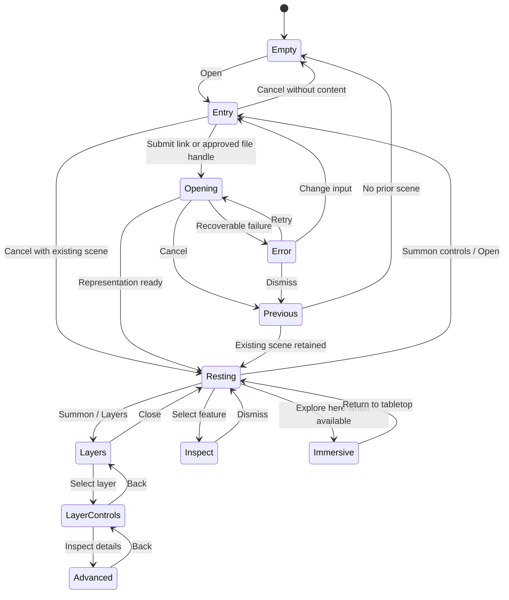

# Quest opening and contextual interaction flow

**Interaction review complete, 2026-09-07, for `geox-k1v.2.3`.** These are wireframes, not a
rendered design, implemented controls or headset usability evidence. Follow
[UI principles](ui-design-principles.md) and the
[scientific scene contract](scientific-scene-contract.md) and its
[portable successor](portable-scene-schema-review.md). Measurement methods remain
separately reviewed work.

## Current wiring and the integration seam

Inspected at `a87c7d7`. `GeoXShared.unity` assigns Quest and mobile prefabs to
`PlatformBootstrapper`, which instantiates the selected variant in `Awake`.
The Quest prefab serializes `MenuManager`'s category levels, scroll container,
metadata fields and fetch button. Its persistent calls include
`OnMetaButtonSelect`, `OnBackLevel1`, `OnBackLevel2` and the download button's
`OnSelect`. `DownloadButtonInteraction.OnSelect` calls
`LobbyManager.CreateInteractableObjects` with bundle/catalog identifiers.

The new Open flow must not call that bundle-specific entry point for arbitrary
models. Catalog can retain its adapter; Shared session owns room operations.
Inspect and migrate each serialized call when implementing #15, preserving the
existing runtime path until its replacement is validated. Keep the platform
bootstrapper's one-time setup. #150 supplies only demonstrably missing keyboard,
ray and rig wiring after the normal components are integrated.

The historical #15 instruction to reproduce old menus conflicts with the newer
user design direction and dated issue update. Preserve the capabilities, not
the old menu hierarchy, HoloLens acceptance, or exact screen layout.

## Entry, attention and recovery

An empty scene offers Open prominently, with Catalog and Shared session as
secondary choices. Once content is present, dismiss entry UI and let the dataset
dominate. Show a brief contextual manipulation hint on first use, dismissible
without performing a gesture. Do not invent a fixed disappearance timer before
testing readability and discoverability on Quest.

A deliberate menu action summons controls near the dataset at a comfortable
position. Bind it through the modern input-action asset, with hand and controller
paths chosen during #16. Do not assume a particular reserved hardware button or
gesture is available. While controls are open, show an explicit Close action;
Back steps to the preceding panel, then returns to the dataset. Changing hand
tracking state must not strand the user in a tool or keyboard state.

Opening a secondary panel replaces the current panel in the same interaction
area. It does not stack another modal. A panel stays readable while attended or
focused; it does not follow the user's head continuously or disappear mid-input.
Focus returns to the invoking control after dismissal. A documented fallback
menu action exposes Recenter and Return to tabletop even if the dataset is out
of view. These are recovery actions, not permanently floating toolbars.

## State flow



Opening state belongs to an operation identity, not a shared boolean. Late
results from a cancelled or superseded request cannot replace the active scene.
While adding a layer, retain the working scene on failure. While replacing an
entire scene, keep the old scene until the new content is ready when the measured
memory budget allows. If coexistence is unsafe, explain that opening will close
the current scene before the user proceeds; do not silently evict content.

## Interaction wireframes

Brackets denote intended controls, not a requirement for visible rectangular
buttons. The scene area is the largest part of each view. Values marked unknown
are intentional; the wireframes contain no fabricated observations.

### Empty and entry

```text
                  Open a dataset
                     [Open]
             [Catalog]  [Shared session]

Open
  [Paste or enter a link________________]
  [Open link]                 [Cancel]
  [Choose a file]   — only when file entry is implemented
```

No room, hosting account, catalog category or CRS form is required to start.
Keyboard appears only while editing. Submission and keyboard dismissal must be
distinct; dismissing the keyboard does not discard the link. Present only entry
routes actually implemented on the current platform.

### Opening and error

```text
            [existing dataset, if any]

       Opening dataset…             [Cancel]
       Downloading / Preparing / Placing

       Could not open the model
       A required texture could not be found.
       [Retry]  [Change link]        [Dismiss]
```

Use the operation's actual phase. Show byte progress only when meaningful;
parsing and unknown-size responses use an indeterminate state. Error text
distinguishes expired access, unavailable companions, unsupported content and
resource limits. Technical details are expandable and redact credentials.
Cancellation is acknowledged promptly even if native resource cleanup finishes
later. Do not expose a synthetic percentage or call pending cleanup complete.

### Resting and summoned controls

```text
                     [dataset]
              (no persistent panel)

          — after intentional summon —
          [Layers] [Inspect] [More] [Close]
```

Grab moves the scene. Two-hand manipulation changes its display scale; rotation
also acts on the scene root. Feature selection opens inspection. More contains
less-frequent Open, Shared session, Reset view, Recenter and available viewing
mode actions. A calibrated scale readout appears when it aids interpretation;
otherwise show display scale/unknown physical calibration on demand.

### Layers and selected-layer controls

```text
Layers                                [Close]
  Terrain                           [visible]
  Imagery                           [visible]
  Samples                           [visible]
  [Add dataset]                       [Back]

Samples                               [Close]
  [Visibility]  [Legend]
  [Metadata]    [Provenance]  [Advanced]
  [Unload representation]             [Back]
```

These layer names come from the user's tabletop example. Use a simple list,
not a permanently expanded tree. Show opacity only when meaningful for that
representation. Selection and visibility are independent. Selecting a hidden
layer does not silently reveal it or move it. Distinguish unloading its render
resources from explicitly removing its scientific record; give removal an Undo
path where feasible rather than nesting confirmation dialogs.

### Inspection and advanced detail

```text
               [selected feature]
            Feature details           [Close]
            Location: unavailable
            Physical calibration: unknown
            [Metadata] [Provenance]

Advanced                              [Close]
  Reference body / frame: as supplied, or unknown
  Axis and unit definitions: as supplied
  Source registration: supplied / unavailable
  Validation evidence: supplied / unavailable
  [Processing history]                [Back]
```

Place a compact readout near selection without obscuring it; allow repositioning
or a comfortable fallback location. Present scientific coordinates only when
resolved through the accepted domain mapping. Body and unit context accompany
readouts where needed; detailed CRS definitions stay in Advanced. Missing values
remain visibly unknown. No automatic Earth map labels for Moon, Mars or local
content, and no claim that declared registration has been independently verified.

### Measurement preview and immersive continuity

```text
Measurement design preview — unavailable in the initial GLB build
  Select a starting point
  Select an ending point
  Distance: —
  [Clear] [Done]

Immersive view
                  [same scientific dataset]
          [Return to tabletop] — on summon
```

Measurement is shown here to reserve interaction space, not to select a distance
method or promise an implemented tool. Later tools use contextual point picking,
clear units and uncertainty, plus an obvious exit. Pending or unavailable
methods are not offered as functioning controls in the initial build.

Explore here changes viewpoint/display representation of the same scene. Return
restores the tabletop view without losing selection, layer visibility, identity
or registration. Near-1:1 wording requires a physical scale basis from declared
units/mappings or calibration; retain its validation status as specified in the
[reviewed contract](scientific-scene-contract.md). Keep local viewpoint changes
distinct from shared scene placement, with semantics reviewed during
network integration.

## Library-neutral UI boundary

These are proposed messages and view-state semantics, not new Unity APIs.

| UI intent / event | Payload and behavior |
|---|---|
| Open requested | Operation ID, input reference and intent: new scene, replace, or add layer. URI/handle resolution belongs to the input adapter. |
| Cancel requested | Operation ID. Only that operation is cancelled; prior working content stays usable. |
| Load status | Operation ID, stage, available progress, recoverable error and supported next actions. Ignore stale operation updates. |
| Representation ready | Operation ID and stable scene/layer identity. The domain/loader owns registration and resource lifetime, not the view. |
| Layer selected / visibility changed | Stable layer ID and desired state. UI does not infer identity from GameObject names or array positions. |
| Inspect requested | Selection identity and pick information. Domain resolves scientific meaning; UI formats supplied values. |
| Reset / recenter / display manipulation | Scene identity and display intent. No source-coordinate edits. |
| Shared session requested | A separate session operation. A local load remains usable without joining. |

Use a fake loader during UI development to exercise status, cancellation and
late-result behavior independently of importer packages. Do not create a global
event bus, service registry, alternate scene model or generic command framework
solely for these messages. Choose concrete interfaces when the domain contract
and importer integration are settled.

## Link handoff, files and sharing

Start with explicit HTTPS entry. Evaluate a direct OS link handoff into the app
before designing a pairing service. The device task must establish actual Quest
dispatch, foreground/background behavior and recovery from expired access; this
document does not assume deep links, QR scanning or clipboard bridging work.

For local files, use a platform-granted handle and scoped access. Companion-file
permission, cancellation and expired handles need separate tests from single
GLB opening. Keep private links out of recents, logs and shared payloads. Do not
copy source data into a hosting service simply to make opening easier.

Joining a shared session retains explicit per-client loading/failure states.
Do not show a scene as shared successfully because one client rendered it.
Permission failures offer private local viewing or an authorized access route;
they do not trigger credential forwarding. Session controls appear only when
the user invokes sharing or is participating in a session.

## Design-test disposition and remaining evidence

| Element | Why it exists / why it recedes |
|---|---|
| Open entry | Required to choose data; disappears after placement. |
| Manipulation hint | Makes direct action discoverable; dismissible and not a permanent legend. |
| Summoned controls | Discoverable alternative to gestures; deliberate summon and Close replace a permanent toolbar. |
| Layer list | Resolves visibility/selection ambiguity; shown only on request. |
| Inspection readout | Explains the selected feature; contextual, with technical depth disclosed separately. |
| Units/body/conflict state | Necessary to interpret a result; visible when relevant even if advanced detail is closed. |
| Reset/recenter/return | Recoverability when content or controls leave view; reachable through the fallback menu. |
| Progress/error | Explains an active operation and gives recovery; disappears when resolved. |

The design uses ordinary scientist-facing names rather than GIS expertise as a
prerequisite. Coordinate inference is allowed only where supported metadata and
methods make it justified. No control is retained solely because the old UI had
it. Visual styling, exact input bindings, typography, contrast, target dimensions,
placement and transitions remain to be prototyped and validated on Quest in
#15/#16/#150 and `geox-k1v.2.5`. The wireframes do not establish those properties.

**Disposition: accepted interaction contract for implementation.** The opening,
disclosure, recovery and loader-state flows satisfy the supplied UI principles.
Registration is a separate contextual action with the
[reviewed preview/apply/cancel/undo workflow](geodetic-registration-review-2026-09-07.md).
It never changes the meaning of ordinary scene manipulation. Scientific scene
revision and personal view/session state follow the portable contract. No numerical
measurement method is selected here. Visual styling, exact bindings and headset
ergonomics still require the existing implementation/device tasks. No prefab or
runtime code was changed during this review.
